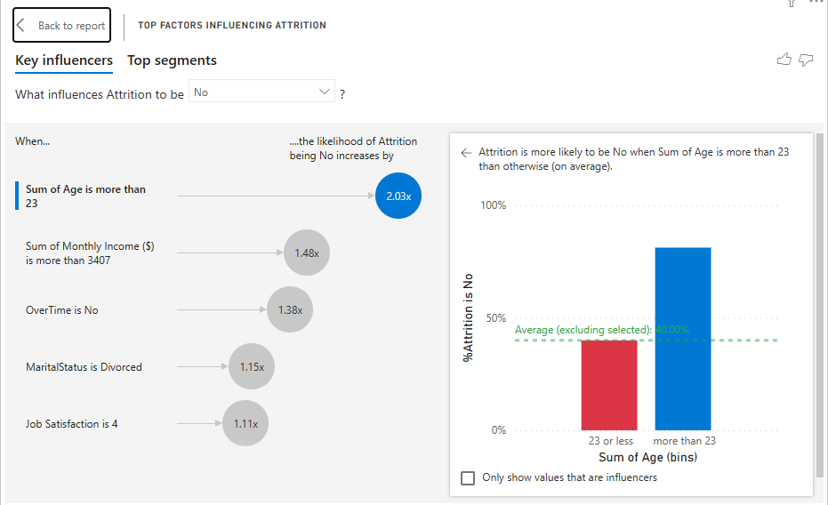

# 📊 IBM HR Analytics Dashboard




## 🎯 Project Overview

An interactive Power BI dashboard analyzing employee attrition patterns at IBM, helping HR teams identify retention risks and develop targeted strategies to reduce turnover.

## 📈 Business Problem

Employee attrition costs companies an average of **$15,000 per employee** in recruitment and training expenses. This dashboard helps organizations:

- Identify high-risk departments and roles
- Understand factors driving employee turnover  
- Predict at-risk employees before they leave
- Make data-driven retention decisions

## 🔍 Key Insights Discovered

### 1. **Department Analysis**
- **Sales Department** has the highest attrition rate at **20.6%** (4.5% above company average)
- R&D shows moderate attrition at **13.8%**
- HR has the lowest attrition at **19.0%**

### 2. **Tenure Risk Window**
- **54% of attrition** occurs within the first **5 years**
- Critical period: **0-2 years** (highest spike)
- Employees who survive past 5 years show strong retention

### 3. **Satisfaction Impact**
- Employees with **low job satisfaction (1-2)** are **2.8x more likely** to leave
- Work-life balance rating of 1 correlates with **31% attrition rate**

### 4. **Compensation Factor**
- Average income of attrited employees: **$4,787**
- Average income of active employees: **$6,832**
- **30% income gap** between groups

### 5. **Overtime Effect**
- Employees working overtime: **30.5% attrition**
- Employees without overtime: **10.4% attrition**
- **Overtime = 3x higher attrition risk**

## 🛠️ Tools & Technologies

- **Power BI Desktop** - Data visualization and dashboard development
- **Power Query** - Data transformation and cleaning (removed 3 redundant columns)
- **DAX (Data Analysis Expressions)** - Created 10+ calculated measures
- **Data Modeling** - Single-table analysis with optimized relationships

## 📊 Dashboard Features

### Page 1: Executive Overview
- **5 KPI Cards**: Total employees, active count, attrition count, rate %, avg income
- **7 Interactive Visuals**:
  - Attrition by Department (Bar Chart)
  - Age Distribution (Donut Chart)
  - Income vs Age Attrition Patterns (Scatter Plot)
  - Attrition Trend Over Tenure (Area Chart)
  - Job Satisfaction Impact (Column Chart)
  - Work-Life Balance Analysis (Stacked Bar)
- **4 Dynamic Slicers**: Department, Gender, Overtime, Job Role
- **Cross-filtering**: Click any visual to filter entire dashboard

### Page 2: Employee Details (Drill-Down)
- Detailed employee table with conditional formatting
- Matrix breakdown by Department → Job Role
- AI-powered Key Influencers analysis

## 📁 Dataset Information

**Source**: [IBM HR Analytics Employee Attrition Dataset (Kaggle)](https://www.kaggle.com/datasets/pavansubhasht/ibm-hr-analytics-attrition-dataset)

**Size**: 1,470 employees × 35 attributes

**Key Fields**:
- Demographics: Age, Gender, Marital Status
- Job Info: Department, Role, Level, Business Travel
- Compensation: Monthly Income, Salary Hike, Stock Options
- Satisfaction: Environment, Job, Relationship, Work-Life Balance ratings
- Performance: Performance Rating, Training Times
- Tenure: Years at Company, in Role, with Manager, since Promotion
- **Target Variable**: Attrition (Yes/No)

## 📐 DAX Measures Created
```DAX
// Basic Metrics
Total Employees = COUNT('Employee Data'[EmployeeNumber])

Attrition Count = 
CALCULATE(
    COUNT('Employee Data'[EmployeeNumber]),
    'Employee Data'[Attrition] = "Yes"
)

Attrition Rate % = 
DIVIDE([Attrition Count], [Total Employees], 0) * 100

Active Employees = 
CALCULATE(
    COUNT('Employee Data'[EmployeeNumber]),
    'Employee Data'[Attrition] = "No"
)

// Advanced Metrics
Avg Monthly Income = AVERAGE('Employee Data'[MonthlyIncome])

Avg Income (Attrited) = 
CALCULATE(
    [Avg Monthly Income],
    'Employee Data'[Attrition] = "Yes"
)

Dept Attrition Rate = 
VAR DeptAttrition = CALCULATE([Attrition Count], ALLSELECTED('Employee Data'[Department]))
VAR DeptTotal = CALCULATE([Total Employees], ALLSELECTED('Employee Data'[Department]))
RETURN DIVIDE(DeptAttrition, DeptTotal, 0) * 100
```

## 🎯 Business Recommendations

Based on the analysis, I recommend:

1. **Sales Department Intervention**
   - Implement monthly 1-on-1s with Sales reps
   - Review compensation structure (30% below company average)
   - Reduce overtime requirements

2. **Early Tenure Support Program**
   - Mandatory mentorship for 0-2 year employees
   - 90-day check-in protocol
   - Clear career progression roadmap

3. **Work-Life Balance Initiatives**
   - Flexible work arrangements
   - Overtime cap policies
   - Wellness programs for high-stress roles

4. **Satisfaction Monitoring System**
   - Quarterly pulse surveys
   - Exit interview analysis
   - Predictive attrition model (ML next phase)

## 🚀 How to Use This Dashboard

### Option 1: Power BI Desktop (Full Interactive Experience)
1. Download `IBM_HR_Analytics_Dashboard.pbix` from `/PowerBI` folder
2. Open with Power BI Desktop (free download: [microsoft.com/power-bi](https://microsoft.com/power-bi))
3. Click slicers to filter data
4. Hover over visuals for detailed tooltips
5. Navigate to "Employee Details" page for drill-down analysis

### Option 2: View Screenshots
Browse the `/Screenshots` folder for static views of all visuals

### Option 3: PDF Report
Download `IBM_HR_Analytics_Report.pdf` from `/Documentation` folder

## 📸 Screenshots

### Main Dashboard


### Department Analysis


## 📚 Documentation

This project includes comprehensive documentation:

- **[📊 Insights Summary](Documentation/Insights_Summary.md)** - Detailed analysis findings and business recommendations
- **[📖 Data Dictionary](Documentation/Data_Dictionary.md)** - Complete field definitions and data descriptions
- **[🖼️ Screenshots](Screenshots/)** - Dashboard visualizations and examples

## 🎓 What I Learned

- **Data Preparation**: Cleaned and transformed raw CSV data using Power Query
- **DAX Proficiency**: Created complex calculated measures with CALCULATE, DIVIDE, FILTER functions
- **Data Visualization**: Chose appropriate chart types for different data stories
- **UX Design**: Implemented interactive slicers, cross-filtering, and drill-through navigation
- **Business Intelligence**: Translated data patterns into actionable business recommendations
- **Storytelling**: Designed dashboard flow to guide users through key insights

## 📝 Project Challenges & Solutions

**Challenge 1**: Attrition Rate % showing as decimal (0.161 instead of 16.1%)
- **Solution**: Multiplied by 100 in DAX and formatted as fixed decimal

**Challenge 2**: Too many job roles cluttering slicer
- **Solution**: Changed to dropdown style instead of tile layout

**Challenge 3**: Scatter plot hard to interpret with overlapping points
- **Solution**: Adjusted transparency (60%), added size variation, enabled zoom slider

## 🔮 Future Enhancements

- [ ] Add predictive attrition model using Python/R integration
- [ ] Include time series analysis with monthly attrition trends
- [ ] Create employee risk score calculator
- [ ] Build automated email alerts for high-risk departures
- [ ] Integrate with HR systems for real-time data refresh

## 👤 Author

**Arjun Thorlikonda**
- LinkedIn: [https://www.linkedin.com/in/arjun-thorlikonda-422b9a256/]
- Email: [arjunthorlikonda15@gmail.com]

## 📄 License

This project is licensed under the MIT License - see LICENSE file for details.

## 🙏 Acknowledgments

- Dataset: IBM HR Analytics (via Kaggle)
- Inspiration: [[Any Power BI community resources you used: ](https://community.fabric.microsoft.com/t5/Power-BI-forums/ct-p/powerbi)]
- Tools: Microsoft Power BI, Power Query, DAX

---

⭐ **If you found this project helpful, please star this repository!**

📧 **Questions or feedback?** Open an issue or reach out via LinkedIn!
